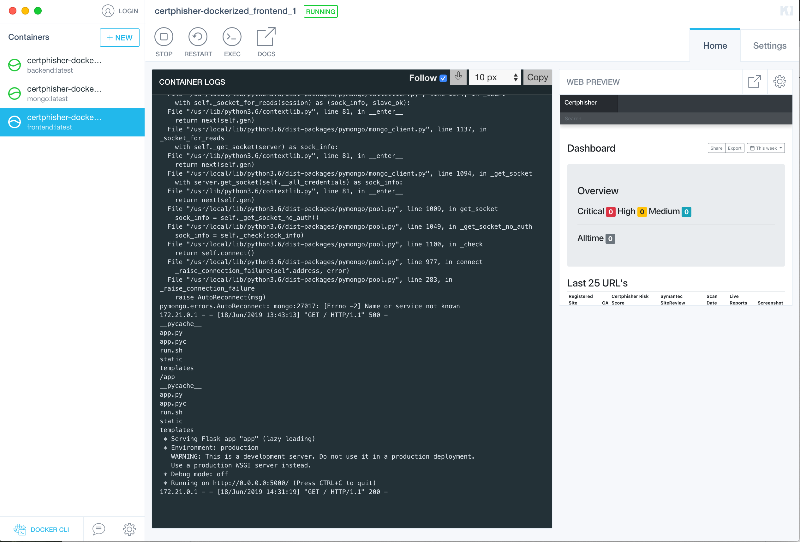

# certphisher-dockerized
Dockerized version of [certphisher](https://github.com/joelgun-xyz/certphisher)

This is a fork of [@x0rz's](https://twitter.com/x0rz) awesome [phishing_catcher](https://github.com/x0rz/phishing_catcher).
I've updated his scoring engine with a submit functionality to VirusTotal, urlscan.io who fetches the response to a mongodb + flask frontend with slack integration for later review.

Feel free to modify, tweak the code. 

## Getting Started

Clone git repo to desired directory. 

```
git clone https://github.com/joelgun-xyz/certphisher.git 
```

### Prerequisites

Make sure you have Docker installed on your local machine and have a DockerHub account.  

[Docker](https://docs.docker.com/v17.12/install/)

Download Kinematic - Run containers through a simple, yet powerful graphical user interface.
[Kitematic](https://kitematic.com/)

#### Edit config
Edit the **default-config.ini** with your API keys and rename it to **config.ini**.

```
; config.ini
[apikeys]
vt_key = XXXXXXXXXXXXXXXXXXXXXXXXXXXXXXXXXXXXXXXXXXXXXXXXXXXx
urlscan_key = XXXXXXXXXXXXXXXXXXXXXXXXXXXXXXXXXXXXXXXXXXXXXXXXXXXx


[mongodb]
my_instance = mongodb://localhost:27017/
my_db = certphisher
my_col = sites
username = foo
password = bar

[slack]
integration = 1
bot_key = XXXXXXXXXXXXXXXXXXXXXXXXXXXXXXXXXXXXXXXXXXXXXXXXXXXx
channel = XXXXXXXXXXXXXXXXXXXXXXXXXXXXXXXXXXXXXXXXXXXXXXXXXXXx
relevant_score = 140
```

#### Slack Notifications

If you don't want or don't have yet a slack channel you can create one here: 

* [Slack API](https://api.slack.com/slack-apps)

or disable this feature in the config.ini file with this line: 
```
slack_integration = 0
```

If you want to be notified about newly registered and high scored domains, 
you can adjust the score depending on your rating system when to fire a notification in your slack channel.  

```
relevant_score = 140
```


If you enable notifications, you get messages like this in your channel:


## Installation 

Switch inside the certphisher-dockerized directory and run these commands to download and build the containers.  

```
docker build --rm --no-cache -f "Dockerfile_frontend" -t certphisher/frontend:latest .

docker build --rm --no-cache -f "Dockerfile_backend" -t certphisher/backend:latest .

docker-compose -f "docker-compose.yml" up -d --build
```


## Usage 

Start Kinematic and watch your containers start correctly



The webfrontend should be served over: **http://localhost:5000/**


## Authors

* **joelgun** - [Twitter](https://twitter.com/joelgun)


## Acknowledgments

* heywoodlh - for the great urlscan.io python wrapper [Github](https://github.com/heywoodlh/urlscan-py)

